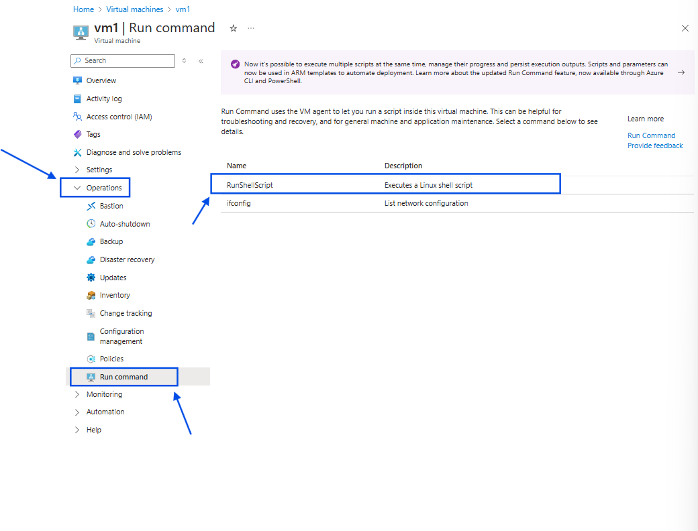

## Compute Services on the Cloud

## Working With Images

* Azure VM Image is snapshot of managed disk + additional metadata
* In Azure VM images we have two types of VM images
    * Generalized VM images : These images will allow the user to set username and passwords/keys during creation
    * Specialized VM images : same as AMi(usernames are fixed)
* Azure while creating the image will remove all the user specific information from vm and then taken a snapshot
* So once we use a vm to create a generalized vm image, vm becomes unusable.
* Azure VM images also are of two types
    * free
    * paid
* Azure also has market place

* Azure VM image has four properties
    * publisher : Organization/individual who is publishing image
    * offer : product name/ server name
    * sku : version of the product/ different releases
    * Version: current versions
* Azure vm image has a unique id or URN <publisher>:<offer>:<sku>:<versions>
* To store vm images we create a compute gallery with a vm image definition and a specific image version.
* image definitions are like to store an application with different versions

**Activity**

* create a new resource group for this activity 
* Create a new virtual Machine and install nginx/apache and host a website by following below instructions
* Use ubuntu machine
```bash
#!bin/bash
sudo apt update
sudo apt install nginx unzip -y
cd /tmp && wget https://www.free-css.com/assets/files/free-css-templates/download/page294/troweld.zip && unzip troweld.zip
sudo mv /tmp/troweld-html /var/www/html/troweld

```
 
* Write abocve script in Advanced tab while creating virtual machine and create VM
* Now verify the website and connect to VM once to check connection

*Taking IMage*

* Go to Virtual Machines and select the created Virtual Machine
* in the horizantal blade find `Capture` select Capture and click on Image


* Create a New Gallery and select Generalized
* Gneralized : if you select this the user data from the VM is deleted and takes the snapshot. provides option to create a new Vm with new user details
* Specialized : if you select this , all the data will remain same including user details

* Select Create new `image definition` fill all the details


* Create image 
* This will take a decent time to crete VM , as we selected Generalized image
* the VM won't work `delete the VM ` check the website and connection to vm for confirmation

* After deletion of VM, Create a new VM 
* while slecting a new VM image select on `see all images`


* here select shared you will find the image you created above select it and create VM.
* After creation of VM, take public ip and check whether website is working or not and check SSH connection from powershell

## Working with Scaling

* Scaling refers to increasing machine sizes or machines
* Scaling is of two types
    * Vertical Scaling
    * Horizontal Scaling
* Vertical Scaling : This refers to increse in size of CPU/RAM or even instance families in cloud

**Activity**

* Open `Virtual Machine Scale Sets` and click on Create New

* Provide Resource group name
* Give Scale Sets Name 
* Region make sure your image is there in same region
* select zones
* Orchestration:
    * Flexible : you can add different types of Vm's with different sizes
    * Uniform : Here it is Same Virtual Machines with sizes


* Scaling :
    * Manually update the Capacity : Maintain a fixed amount of instances
    * Autoscaling : Scaling based on a CPU metric, on any schedule.

* **Select `Manually update the capacity` option**
* Select instance count = 2


* image : click on see all images
    * under `shared` select your desired image

* size :
    * select your desired size

* username : someusername
* Authentication type : choose one of them Password/SSH public key
* License type : Other
* click on Next (Spot)
* **SPOT VM's** 
Spot VM's are defined as, where there is less demand for VM's Azure offers higer size VM's for low cost, these are not permanet. this is will be taken back without any intimation at any time. there is risk involved.
    * This section provides to utilize SPOT VM's which comes for low cost
    * These VM's will be taken back at any time.

* Skip this and go to next section

Disks :

* Change OS Disk type = standard SSD to decrese our cost

Networking :

* Select the virtual network if you have created, make sure the image shoud be there in same region 
* select the `edit` icon for NIC card
    * Enable public ip [this is to verify in our activity]
    * select inbound ports
        * SSH
        * HTTP


* Select `None` for LoadBalancing options

Management :

Management tells about upgrading of VM's

The Upgrade Policy in Azure Virtual Machine Scale Sets (VMSS) allows you to control how updates to your instances are applied. You can either manage upgrades manually, let Azure apply them automatically, or use a rolling upgrade strategy to apply changes incrementally across your instances. The rolling upgrade option offers the best flexibility for critical applications, allowing for high availability during the upgrade process.

* the options speaks about answer for below question
    * how do you want to upgrade your machines when a new version of image comes in
    
    * Automatic : (Azure will take over this)
        * when you give a new image Azure will automatically update all the machines with new image without any downtime.
    * Manual :
        *  you have to click on some button to happen this upgrade
    * Rolling :
        * this option is for upgrading batch wise


* Select `Automatic` and go to next section

Health :

* Enable Application health monitoring
    * this will check your application is active or not
    * Confgure :
        * you can give a path here, so that you can check whether the page is responsive or not.
    * if the page is not responsive for the port 80 , using Automatic repair enabled, the vm will be deleted and creates a new


Advanced :

* How you want your scaling to be done 


* select `Force strictly even balence across zones` :
    * this option make sure that if you hve 1o machines it will maintain 5 in one zone and 5 in another zone.
* Spreading algorithm:
    * Max spreading :
    * fixed spreading
        * for fixed you need to create `fault domain` which is not recommended.
* Review and create it.
* Once deployment is succesfull

* Open the virtul machine scalesets
   
* from the left side balde select `Instances`
* check the number of instances the count will be `2`
* As we selected `Manual update capacity` and the count we gave 2, since it created 2 machines.

* login to both machines
    * use public ip and login from poweshell
    * login : ssh Ara@_ip_
    * after logged in
    * install Stress appllication, which increses stress on cpu and shows 100%.
    * cmd : `sudo apt install stress`
    * after installation is finished , type cmd : `stress`
    * 
    * copy the hilighed line : `stress --cpu 8 --io 4 --vm 2 --vm-bytes 128M --timeout 15m -v`
    * change the timing at last 
    * do this on both the machines.
* Above activity increses load on both machines 
* As we enabled Manual the VM'd wont ge incresed based on any factor the count remains same.
*Even if one of the two VMs is deleted, a new VM will not be created to maintain the desired count. This feature is not available in Azure but is supported in AWS.*
* To enable this feature, you need to change the update policy to `Automatic` and set the
* Now go to `Availability+ scale` section
    * select Scaling option


* rigt side you can see two options
    * Manual Scale
    * Custom autoscale
* select `Custom autoscale` 

* select Scale based on a metric option

* select Add Rule

* here the default metric name is cpu percentage, let it be. based on the requirement you can choose from the list
* below it shows the Avg CPU usage

* Operator :
    * choose greater than 
* Metric threshold to trigger scale action
    * choose 70
* duration put 5 min [checks cpu for every 5 min]

* Operation :
    * select increase count by 
* instance count = keep 1 [it means when cpu threshold increses by 70% then 1 vm will be created]
* select Add rule to add one more rule to decrease a vm if the CPU below 40%

* save and come back
* below you can see instance limits

* here you can see the instance count for min is 2 and max is 2 increase max by 1 that is 3, and default keep 2.
* Save the configuration and wait for few minutes, it will create one more vm as the stess increses to 100% .
* after the new vm is created and go to two machins and stop the execution.
* cmd to stop : ctrl+c
* wait for few minutes agin it will delete one vm.

## Configure LoadBalencer for VMSS

A **load balancer** is a tool that distributes incoming traffic evenly across multiple servers to:

- Prevent overloading any single server.
- Ensure high availability and better performance.
- Automatically redirect traffic if a server goes down.

Think of it like a traffic cop directing cars (users) to different open lanes (servers) so everyone moves smoothly without jams.

### **Layer 4 Load Balancer:**
- Operates at the **transport layer** (Layer 4 of the OSI model).
- Balances traffic based on **IP addresses** and **ports** (e.g., TCP/UDP traffic).
- Does not inspect the actual content of the traffic (e.g., HTTP requests).
- Faster and more efficient but less intelligent.
- Example Use: Routing packets for a database or application server.

---

### **Layer 7 Load Balancer:**
- Operates at the **application layer** (Layer 7 of the OSI model).
- Balances traffic based on **content of the request** (e.g., URL, headers, cookies).
- Can perform smart routing, such as sending requests for `/images` to one server and `/api` to another.
- More flexible but slightly slower due to deeper packet inspection.
- Example Use: Routing web application traffic (e.g., HTTP/HTTPS).


* Create Application gateway (layer 7 load balencer)/ load balenser
* Follow below images to create Application Gateway.


* Take the Loadbalenser ip and check whether the site is working or not
* if it is working then you have successfully created the load balencer for vmss.

## Change image for VMSS [upgrading the image]

* Create a new VM and deploy different website and take image from it. and give version 1.1.0.


* Open the VMSS under, see above image select `Operating System` and top left side you can see `Change image reference`


* change the image by seeing above image
* Apply
* The upgrade will be done automatically after few minutes
* check manually and through load balencer if it comes with new site the deployment is succesful.

## Azure VM States


* Above images shows the multiple steps a vm undergoes during creation.
[Azure official docs](https://learn.microsoft.com/en-us/azure/virtual-machines/states-billing)


* the stop which we do from portal leads to deallocation, so no bill. but there will disk charges


## Disk Related Options in Azure VM
* In Azure we have virtual disks managed by Managed Disk and Temp Disk (Local storage)
* Data in local storage will be erased when you stop instance
* Azure uses Data Disks (Managed disks) for persistence even after vm is stopped or deleted
* In Azure many instance sizes come with local storage and information is present in vm size detailing
* Azure has a restriction on number of disks according to vm size


## Agents in Azure VM

* Azure VM will have an inbuit agent running inside VMs
    * Linux VM Agents [azure official docs](https://learn.microsoft.com/en-us/azure/virtual-machines/extensions/agent-linux)
    * Windows VM Agents[azure official docs](https://learn.microsoft.com/en-us/azure/virtual-machines/extensions/agent-windows)

**Activity : LOST PEM File in Azure**

* Open the VM in azure.
* from the left side blade select click on `Help`, from the list select `Reset Password`

* fill the necessary details
    * create a new SSH key from `SSH key` services
    * select `Add SSH public Key`
    * let username be same
    * select `Use existing key stored in Azure` 
    * now select the new key and `Update` the change.

### if you want to Run any script without logging into Machine even after lost the pem file

* Open the VM ,find the `Operations` section expand it.
* find `Run Command` option and click on it.
* select `RunShellScript` 


* enter above script and run, it will execute the script and shows output below
* to test, take public ip and browse it you should get nginx page where a sign of script executed correctly.


* public ip for vm is not necessary if you want to connect with bastion host.

* Azure update manager for patching the machines all at once
* Azure key vaults to store the keys. the stored key are shared for user through providing read access for keyvaults.
* automtion accounts, you can write custom code and do operations
