## Identity and Access Management

Azure Identity and Access Management (IAM) is a framework within Microsoft Azure that allows administrators to manage user access, permissions, and roles for resources in Azure. It ensures that only authorized users can access specific resources or perform certain actions, thereby enhancing the security and control of your Azure environment. 

### Key Components of Azure IAM:
1. **Users**:
   - Individual accounts that can access Azure resources. These can be organizational (Azure AD) users, guest users, or service principals for applications.

2. **Groups**:
   - A collection of users with the same access permissions. Permissions assigned to a group automatically apply to all its members.

3. **Roles**:
   - Define what actions a user or group can perform on Azure resources. Roles can be:
     - **Built-in roles**: Predefined roles like Owner, Contributor, and Reader.
     - **Custom roles**: User-defined roles tailored to specific requirements.

4. **Role Assignments**:
   - Assigning roles to users, groups, or service principals to grant permissions for specific resources.

5. **Azure Active Directory (Azure AD)**:
   - The underlying identity platform that manages authentication and provides directory services, single sign-on (SSO), and multifactor authentication (MFA).

6. **Role-Based Access Control (RBAC)**:
   - A feature of Azure IAM that restricts access based on roles. For example:
     - **Reader role**: Allows viewing of resources but no changes.
     - **Contributor role**: Allows creating and modifying resources but no management of permissions.
     - **Owner role**: Full access, including managing access permissions.

7. **Conditional Access**:
   - Policies that control access based on conditions like user location, device type, or risk level.

8. **Managed Identities**:
   - Automatically managed identities for Azure resources to access other services securely, without managing credentials manually.

### Benefits of Azure IAM:
- **Granular Access Control**: Enables precise permission assignment.
- **Enhanced Security**: Reduces the risk of unauthorized access.
- **Centralized Management**: Unified control over all Azure resources.
- **Compliance**: Helps meet organizational and regulatory compliance requirements.

### Use Cases:
1. Granting developers access only to development environments.
2. Allowing external contractors access to specific resources for a limited period.
3. Assigning read-only roles to auditors for compliance reviews.
4. Automating access through managed identities for apps running on Azure.

### Tools for Managing Azure IAM:
- **Azure Portal**: Provides a graphical interface for managing IAM settings.
- **Azure CLI**: Command-line tool for scripting IAM configurations.
- **Azure PowerShell**: For managing IAM via PowerShell commands.
- **Azure Resource Manager (ARM) Templates**: To deploy IAM settings programmatically.

## Azure Entra ID (Azure Active Directory)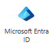
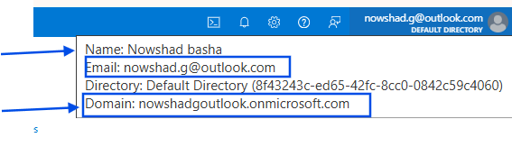
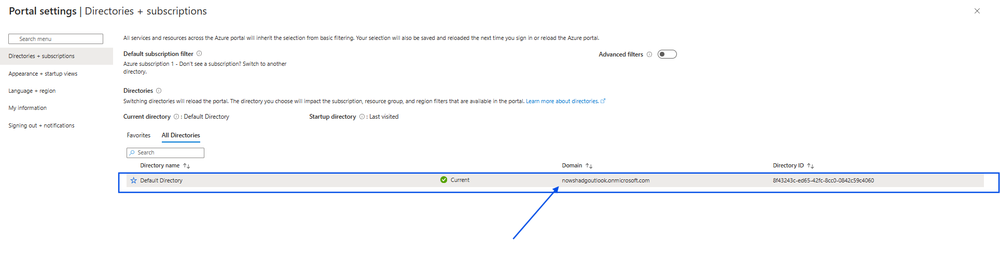

* When you create Azure account/ O365 account you will get access to Azure Entra ID.
* Azure Entra ID is a cloud-based identity and access management solution.
* where a new domain will be created for you with `username@onmicrosoft.com`.

**User Creation**
* when you create a user it will create username using the tenet domain.
* you can also create user using the custom domain.
ex: domain : `nowshadgoutlook.onmicrosoft.com`.
    New User: `User1`
    final Username : `User1@nowshadgoutlook.onmicrosoft.com`.
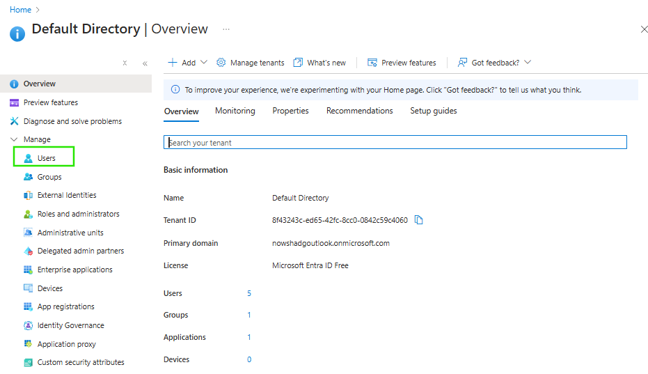
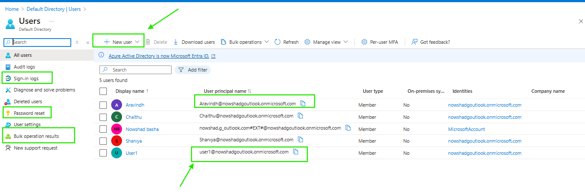
* Sign-in-logs:
    * sign in logs show user login activity
* Roles :
    * roles are used to assign permissions to users, there are two types od roles in Azure
        * Entra ID roles
        * RBAC roles
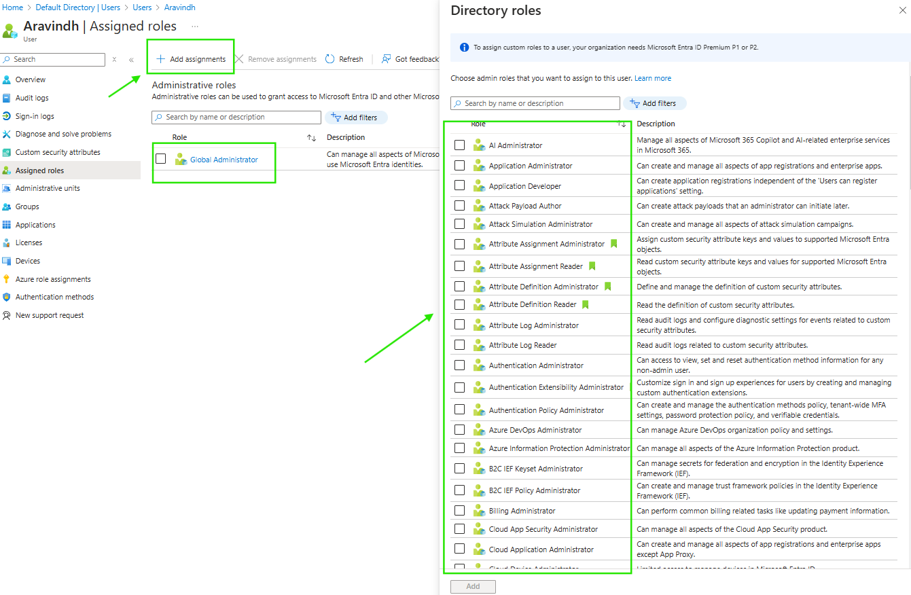
* Entra ID Roles :
    * Above image shows Entra ID roles, which gives permission for only Entra ID Access.
    * if a user is given access with Global Admin role of Entra ID he will get full permissions to do anything inside Entra ID. he won't be able to access any other services in Azure
    * these roles will be available inside User profile with name `Assigned roles`
    * All roles you can see in left blade `Roles and administrators`
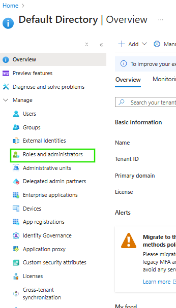
* RBAC roles :
    * These roles are used to provide access to Azure services, you can limit ones access to Azure using these roles.
    * How to Assign Azure access to User follow below images

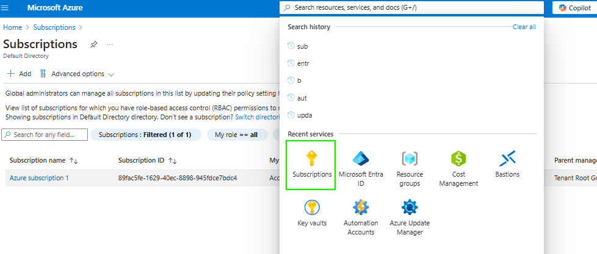
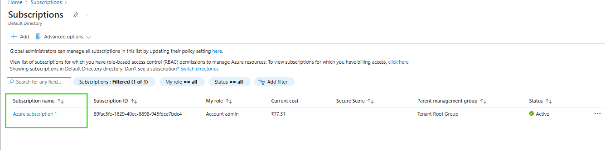
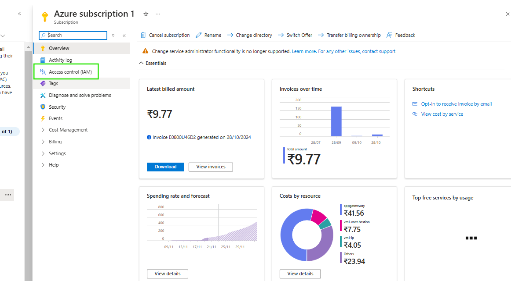
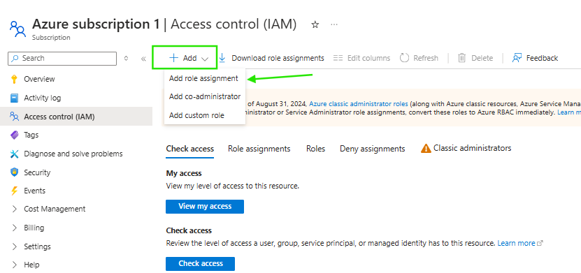
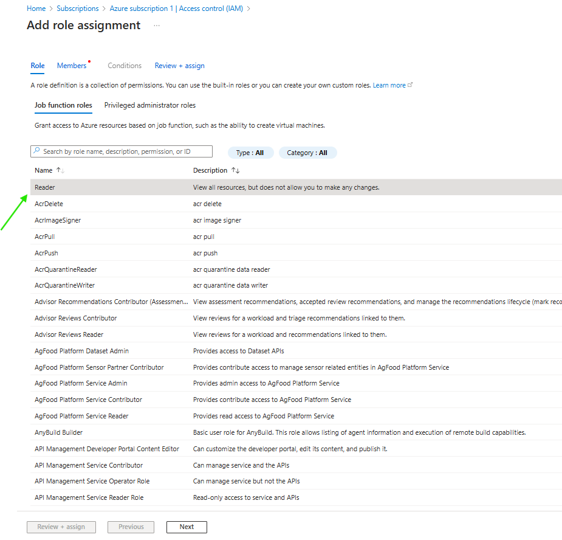
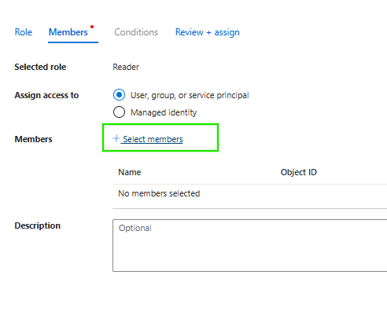
* Review and create, this will give access to a user for Azure Services.

