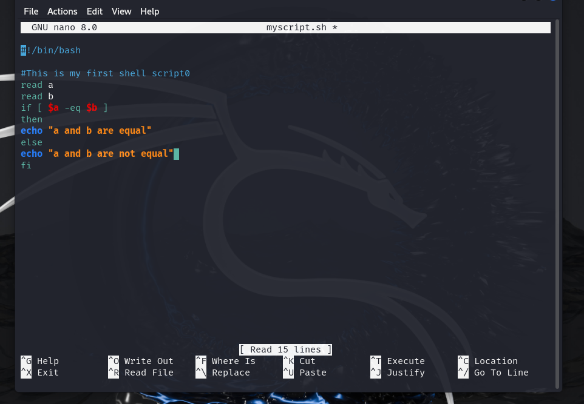
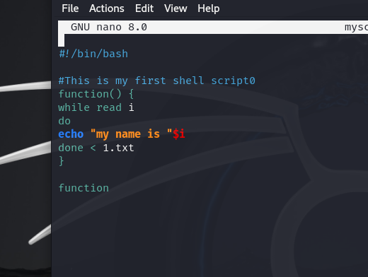

Users

groups

password

shells

restrict sudo su

create user and group ,addgroup to user, del user and group

changing directory from `/`(root) to `~`(home)

to check particular file permissions

file permissions
d- directory
l-linked directory
r- read
w- write
x-execute

assigning permissions for file:

creating new file 2.txt and removing all permissions

pattern follows as 
**file permission** **no.of files** **user** **group** **Size** **Date**

user change Ownership 

simple program[if loop]

