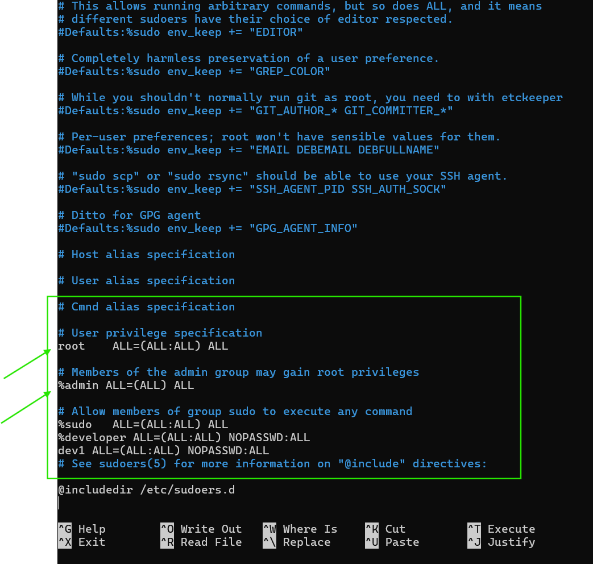

```bash
calender:
---------
sudo apt update
sudo apt install ncal
cal or ncal - calender with highlighted date
ncal <month> <year> - ncal 01 2025 -> provides jan 2025 calender

man command :
-------------

manul page (man)

$ man ls 

this provides the manual for how to use `ls`

Basic Command syntax:
---------------------

<command> <args>
echo        hello

for shell we provide command followed by arguments 

echo hello [echo is command and hello is argument]

There are two types of Arguments
    * Positional arguments
    * Named arguments

Positional Arguments :
------------------------
<command> <arg1> <arg2>
cp 1.txt 2.txt

here position becomes very critical

Named arguments:
----------------
<command> --<arg> <argvalue>

ping -c 4 google.com


* to see hidden files 
ls -a
```

### Linux Directory Hierarchy

* / => root directory
* /bin => Binaries and other executables
* /etc => system configuration files
* /home => home directory
* /opt => optional or third party softwares
* /tmp => Temporary spaces
* /usr => User related programs
* /var => variable data, log

* experiment with mkdir and rmdir.


* ls . [dot represents current directory]
* ls .. [one step back from current]
* ls ../lib [shows inside files of lib]


* file command is used to know more about that file 

* find command

* head and tail commands
    * head command show fist n lines where n is an integer
    
    * default tail command shows last 10 lines of file


### Environmental and shell variables

* Shell variables : Shell can temporarily store variables called as shell variables
* once you logout and login back it cant remember previous values

```
<var-name>=<value>
Topic= linux
to access variable use $
echo $Topic
```

* to make it remember we write values in some files like /etc/environment, later even if you login back and use them


CLASSESS
---------


Class 1:
-------

Directoroy Navigation 

* `.` represents a present folder
* `..` represents parent folder
* `~` Home folder
* linux contains folder and files
* when you get linux fully then it feels Everything in linux is a file.

Class 2:
-------

Linux Directories

* Purpose of following directories
    * /etc
    * /bin
    * /home
    * /var
    * /tmp

* /etc :

Contains configuration files[password configuration,service files, user management, network configuration,package management(apt, dnf)]
* what is configuration ?
* configuration is change in settings of any program, for example : you can change chrome lightning mode from dark to colour or colour to dark this makes a chages in configuration files.
* In linux configuration files are present in /etc folder.
* simply it is settings for linux 

* /bin :

Contains binary files
* binary files are files which are not human readable, they are machine readable that is OS. a file consists of instructions which an operating system can understand and whenever you executues it cpu and memory is allocating and program starts running
* executables
    * Binaris
        * all linux commands will exist here
        * when you do cat for binary files it displays in non-understandable languages
    * Scripts
        * when you cat for these files you can see the scripts
        * !#/bin/bash

* /home :

Home directory is used to store multiple users data, when multiple users use the machine they should have data under their names since all thse are under home directory , in windows it is c:/users folder.

* /var :
Contains Variable data like logs which get changes all the time.

* tmp/ :
Temporary files are stored here.
Temporary files are files which are created for a short period of time and then deleted. For example,...when you download a file from the internet, it is first saved as a temporary file in the /tmp directory, and then moved to its final destination once the download is complete.


* tree structure of linux folders


Navigation and file system

* Absolute paths
* Relative paths
* Commands :
    * pwd - present directory
    * ls - list out files
    * cd - get into 
* go to cd /var/log and do ls, now how to find whether the listed names are files or folders

* ls -al : list out files and folders with their permissions, ownership and size
* anything which is starting with d is directory.
* get into home directoy and find out hidden files
* anything which is starting with .txt is a hidden file.
* ls -a : list out all files and folders including hidden files

File Manupulation

* File Management
     * create :
        * touch => creates an empty file
         
     * edit
        * text editor
            * vim (learnig site openvim.com)
            * nano
     * delete
        * rm -r directoryname
        * rm -rf force deletion
        * rm -i file name -intractive deletion
        * rm *.txt -deletes all the files with extension .txt
* Folder Management
    * create
        * mkdir directoryname
        * mkdir f1 f2 d1 d2 -create multiple foders
    * edit
        * move
            * mv d1 d2 -folder d1 will move to folder d2.
    * delete
        * rmdir dirname -to delete an empty directory
        * rm -r directoryname
        * rm -rf force deletion
        * rm -i file name -intractive deletion
        * rm *.txt -deletes all the files with extension .txt

## Users and Groups

**Users**

* Check Users in linux :
    * cat /etc/passwd
    * getent passwd
    * Check Single user:
        * sudo chage -l sai
    * Check whether account locked:(L defines locked)
        * sudo passwd -S sai
    * Check User exist or not
        * getent passwd | grep sai
    * list users above number 1000
        * getent passwd {1000..1010}
    * Check current user
        * `who` or `users`

* Create User :
    * sudo adduser aravindh
* Delete User :
    * sudo deluser aravindh
* Change password :
    * sudo passwd sai
* Set account expiery date
    * sudo chage -E 2025-05-30 sai
* Set account expiery to never
    * sudo chage -E -1 sai
* Lock User
    * sudo passwd -l sai
* Unlock User
    * sudo passwd -u sai
* change Username :
    * sudo usermod -l "saib" sai
* Add User to a group :
    * sudo usermod -aG group1 saib
* Remove User form a Group
    * sudo gpasswd -d saib group1
* This command sets:
    * Minimum days between password changes to 7 days.
    * Maximum days before the password expires to 90 days.
    * Warning days before expiration to 14 days.
    * Account expiration date to December 31, 2024.
    * `sudo chage -m 7 -M 90 -W 14 -E 2024-12-31 sai`


**Groups**

* Check groups in linux :
    * cat /etc/group
    * getent group
    * getent group | grep group1
    * getent group {1000..1010}
* To check groups assigned to him
    * `groups`
* To check groups assigned for specific user
    * groups saib
* To checks users identity
    * id sai
* To check id
    * id
* Create Newgroup :
    * sudo groupadd group1
* Delete Group :
    * sudo delgroup group1
* Display all users in specific group
    * getent group group1


VIM Editor :

* Basically VIM has two modes
    * insert mode
    * Normal mode
* insert mode allows you to write text same as text editor.
* Normal mode provides an efficient way to manipulate and navigate to text.

* At any time, you can see which mode you are in on the status bar which is located at the top of the editor.
* To change between modes, use `Esc` for normal mode and `i` for insert mode

Cursor movement :
* h - moves left similar to left navigation key `<`.
* l - moves right similar to right navigation key `>`.
* k - move top 
* j - move down

## Shell and Terminal

Termial :
* Terminal is a software that allows you to type commands
    ex: git,bash which are installed on your system


Shell :
* the commands which you wrote in the terminal understands by Shell.
* the software which understands the commands is called shell.
    windows :
        * DOS 
        * PowerShell
    Linux :
        * bash
        * flash ..etc

* how to list all the shells
```bash
cat /etc/shells
```


* in Linux there are two types of users
    * Sytem Users
        * this is crerated to run some applications/services in linux
    * Users

* How to tell whether a user is System user / User.
    * when you see all the users list, where the users doesn't have 'nologin' at last is a system user
    * generally users will be associated with shell and system user will not be associated with shells
* On all linux machines we have `root` User, root user will have full control over machine
* how to change to root user
```
sudo -i
```
* to know who is current user
```
whoami
```
* users can be associated with the groups
* Lets create a Group
    * developer
    * tester
    * devops
* every user has a unique UID and every group will have unique GID
```
Username:password:UID:GID:GECOS:home_directory:login_shell
```
* the users will be listed in above format
* here when you create a user UID will be automatically created, and GID(group id) if you have not assigned to any group it will assign it will create a new group with
username ang brings its id.
* if you assign any group, it shows respective group id.

* lets create a 3 Users
    * dev1
        * group : developer
        * shell : /bin/bash
        * home_directory : /home/dev1
    * test1
        * group : developer
        * shell : /bin/bash
        * home_directory : /home/dev1

    * devops1
        * group : developer
        * shell : /bin/bash
        * home_directory : /home/dev1

```
sudo adduser dev2 --shell /bin/bash --gid 1005
```


```
sudo useradd -s /bin/bash -g 1006 -m test1
```


* adding users to `sudoers` group
    * visudo
    * add to sudo group `usermod -aG sudo dev1`

* visudo :
    * open ` sudo visuo` 


* if a line starts with `%` it is a group and if it starts normally it is a user.
* see above image 

* see above image the blue colurd box content is written for not to ask password
for group %developer and user dev1

to check all disks in linux machine


**sudo visudo**[second way of providing sudo permissions to user]
* if you create new user and add it in this file, he will get full permissions as `sudoers`

* if you create a new user, new group and add user to new group. then if you add this new group to this file the group will get `sudoers` permissions.
ex: * create a new user john
    * create a new group Tester
    * add john to Tester group
    * open `sudo visudo` and add group with all permissions
        * `%Tester ALL(ALL:ALL) NOPASSWD:ALL`
    * save and exit.
    * now switch user `su john` using john 
    * now try to do ` sudo apt update` it will work.


* this commad shows all the devices connected to the linux machine `sudo ls /dev`


**FILE PERMISSIONS**

* `chmod` command is used to change file permissions
* `chown` command is used to change file ownership
* `chgrp` command is used to change file group ownership

**chmod**

Practical :

* Create a new file `touch 1.sh`
* do ` ls -l 1.sh`


* removing all permissions 


* here we have three diffrent access `owner` `group` `other`.
* Owner = u
* Group = g
* Other = o

* the command comes as below
    * `chmod u+r 1.sh` - single permission at a time
    * `chmod u+rw 1.sh` - double pemission at a time
    * `chmod u+rwx 1.sh` - triple permission at a time

    * `chmod g+r 1.sh`
    * `chmod g+rw 1.sh`
    * `chmod g+rwx 1.sh`

    * `chmod o+r 1.sh`
    * `chmod o+rw 1.sh`
    * `chmod o+rwx 1.sh`


Linux Software Installations
----------------------------

* 