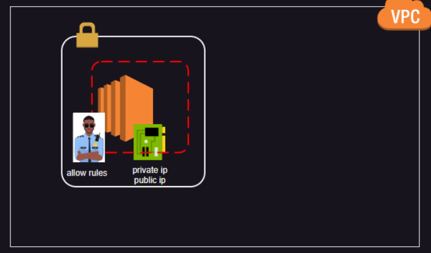

Networks
--------

* Private network ranges :
    * 10.0.0.0/8
    * 172.16.0.0/12
    * 192.168.0.0/16

AWS VPC
-------

* In AWS VPC belongs to Region 
* you can create subnets for Availability zones
* if you want to create 3 vm in different zones, you need to create 3 subnets for each zone and create vm's inside it.

* it has Local zones 
* AWS Local Zones are physical infrastructure deployments that extend the reach of an AWS region into specific metropolitan areas. They are designed to provide low-latency access to cloud-based applications and services for users in those areas. Essentially, they bring cloud computing closer to end-users.
* in short : AWS Local Zones are like mini cloud centers placed in big cities. They make cloud services work faster for people who live nearby. It's like having the cloud closer to home.

Azure Vnet
----------

* In Azure Vnet belongs to region, Azure Regions has directly datacenters as wells as Availability zones

* You can create subnets for region
* if you want to create 3 vm's in different zones, you can create one subnet and add  vms into it.

AWS VPC Activity
-----------------

* Create a VPC with a Name 'Test VPC'and range 192.168.0.0/16
* Now create two subnets web and db by selecting our VPC in two regions 1a and 1b with ranges of 192.168.0.0/24 and 192.168.1.0/24
* create a security group with name Test-secgroup and add inbound rule for allowing all trafic and attach to our VPC .
* create a VM by selecting above all, Vpc, Security group, select subnet, assign public ip.

*Till now we have created A VPC and two subnets and a security group and a Vm in subnet1*
* when you try to access this vm from terminal it won't work. because this vm has public ip but there is no way to intract with internet.
* we need to create a internet gateway, create internet gateway with name Test-internet and attach it to vpc
* go to route table there will be a default route table ,if not create one and seelect it from the details shown below navigate to routes section select edit rules 
* add a new route with destination 0.0.0.0/0 and target TO our internetgateway
* there will be a default route for local with vpc range 192.168.0.0/16.

*Now the configuration is completed you can access vm from terminal as we have attached internet gateway to VPc and add as target for route table* 

VPC Activity 2
----------------

* Create a VPC with Name Vpc-1 and provide range 192.168.0.0/16
* Create 6 subnets within Vpc-1 web-1,web-2,app-1,app-2,db-1,db-2. 
    * web-1 : 192.168.0.0/24
    * web-2 : 192.168.1.0/24
    * app-1 : 192.168.2.0/24
    * app-2 : 192.168.3.0/24
    * db-1 : 192.168.4.0/24
    * db-2 : 192.168.5.0/24
* now create a internet gateway and a security group allowing all trafic with names `internet` and `insecure`.
* Go to Route tables and Create 3 route tables 
    * Route table 1 with Name `public` and associate subnets : web-1 and web-2
    * Route table 2 with Name `private-1` and associate subnets : app-1 and app-2
    * Route table 3 with Name `private-2` and associate subnets : db-1 and db-2
* Select Route table 1 and select `edit routes`add a rule
    * destination : 0.0.0.0/0
    * Target      : internet-gateway

* After attaching internet gateway to the Rtable1 the Web-1,Web-2 became pulic subnets.
* Now, Create 2 VM's 
    * VM1 :
        * select vpc-1
        * enable public ip
        * sec group : insecure
        * subnet : web-1
    * VM2 :
        * select vpc-1
        * enable public ip
        * sec group : insecure
        * subnet : app-1
* After creation take public ip of vm1 do ping test , it will work. try for vm2 it won't work.
* This is due to we have assigned internet-gateway for Rtable 1(public) which have web-1,web-2 subnets.
* Vm2 is exist in app-1 subnet which is there inside of Rtable 2(private-1) and for this we have not added a rule for internet gateway.

* But you can Access Vm2 form Vm1 as they are in same network(Same VPC)

**connect to Vm2 from Vm1**

* ssh for Vm1 from terminal
* now ping Vm2 using private ip of vm2 it will work, to connect to vm2 we need .pem key copy the .pem key you have used and create a file in Vm1 with name text.pem paste inside it and save
* now do ssh form vm1 `ssh -i text.pem ubuntu@ip`
* this will connect to vm2 , now `ping google.com` from vm2 it won't work because vm2 doesn't have internet connnection.

* To provide internet connection without assigning public ip, we have `NAT GATEWAYs` 
* NAT GATEWAYS will a public ip which connects to our subnet app-1 this provide internet to vm2
* Under VPC blade search for NAT Gateways and create one for app-1 subnet
* now go to Route tables select Rtable 2(Private-1) and select `edit routes` add a rule for NAT Gateways
* destination : 0.0.0.0/0
* Target      : NAT-Gateway
* Now, go to VM2 and do `ping google.com` it will work

**Egress only internet gateway**

* ingress means incoming traffic
* egress means outgoing traffic
* Egrress only internet gateway is attached to vpc where complete vpc is private and requires internet access.
* Egress only internet gateway is used to provide internet access to private subnets, where you don't have single public subnet. instead of using NAT Gateway we can use Egress only internet gateway

Security Groups:
-----------------

* Security groups are used to filter the incoming network traffic based on
    * Source ip
    * protocol:
        * Tcp(http, ssh)
        * UDP(Rarely used in private networks, insecure and faster)
        * ICMP (ping)
    * port number

* Simple activities:
    * Go to security groups and remove all the rules and save it. now try to ping to server and try ssh to server it won't work
    * Now, add one inbound rule
        * ICMP - which allows only ping request
        * Http - allows only port 80 to access websites
        * keep Custom ip and provide port 80 and destination select Myip. it will allow only you to access the website
        if you want to provide for a range you can
        * for you - your publicip/32
        * for all - you networkrange/24

* you create multiple security groups 
* create a security group for HTTP for all 0.0.0.0/0
* create one more for ICMP for all
* Now, go to vm select vm from left side blade select network interfaces from there select change security groups and add multiple groups. this feature is available only in AWS.

**ACL's**

* ACL is one more defence layer which is acting on hole subnet level.
* by default all the traffic is allowed, means  all inbound is allowed and all outbound is allowed.
* if there is any conflicts in rules it will validate through priority of the rules.
ex: 
    priority   protocol port  ip          allow/deny
    1000        TCP      80   0.0.0.0/0              deny
    1010        Tcp      *    0.0.0.0/0     allow
    900         Tcp      *                  allow
    *             *      *                   allow 

* now if you try to do http to server it check priority and validates lowest priority is first.(http Tcp 80)
* here it checks for lowest priority number in our case here 900 and and the protocol http comes under Tcp and for this traffic is allowed.

Activity 
--------

* Create a vm and go to security groups delete all the inbound rules which are there 
* now add below rules
    * All icmp - for all
    * ssh - for myip
    * http - for all
* Save it after doing this
* now select Network Acls
* Create one and select our vpc, and associate a subnet where vm is located
* edit outbound rules 
    * add rule number 100 and allow all tcp for all 0.0.0.0/0
* edit inboud rule
    * add rule number 1000 and put all tcp for all 0.0.0.0/0

* now you should be able to connect vm through ssh and access web and not ping .

OSI Model
---------
OSI stands for Open-system-Interconnection
* OSI model is a conceptual framework used to understand the communication between devices on a network.
* There are mainly 7 layer in OSI Model 
    1. Application Layer    
    2. Presentation layer       (1-3 layers are software layers)
    3. Session layer

    4. Trasport layer

    5. Network layer
    6. Data Link Layer          (5-7 Hardware layers)
    7. Physical layer

1. Application layer
-----------------

* Application layer provides user interface, access webpage from browser.
* It is the highest layer of OSI model
* provides different protocols to access like HTTP, HTTPS, FTP, SMTP for mail

2. Presentation layer
----------------

* Here in this layer the data will be reformatting that is data encryption.
* using the data encryption algorithms the data will be encrypted, it appears in non-understandable language, to prevent stealing data.
* it also compress the data and reduces the size.

3. Session layer
----------------

* In this layer, one system will sends a request to another system to establish a session.
* the 2nd system after some verification like login details, session will be created.
* session layer also maintains session until user logouts.
* session layer also adds check points, if any error comes like system crash then data will be sent from only last check point.

4. Transport layer
----------------

* Transport layer is a service to service layer
* in this layer, the program in sending device will communicates with recevers device program 
* whenever you are browsing mutiple web sites like youtube and watsapp, the bits which comes from youtube and watsapp are correctly identified here, by using the ip and port number.
* transport layer also decide which connection type should be used to transfer data.[TCP/UDP]
* transport layer divides the data into segments, so the data can be transported easily.
* it also controles the flow of data

5. Network layer
----------------

* Network layer receives data form transport layer in the form of segments and converts each segment to different packets
* Each packet go through different networks before reaching the destination, it takes most least path in traveling to router to router.
* Network layer uses ip address to transfer paket
* Once the source assigns an ip address of destination to the packet. it will not change during transmission.
* After Network layer data is trasfered to data link layer

6. Datalink layer
----------------

* Data link layer devides the packet of network layer into frames, a packet will be divide into how many frames,depends on the hardware used in data link layer, this hardware device called as NIC network interface card
* this layer uses MAC address to transfer data, and data is trasfered from system to system like when it goes through different devices hubs and switches and router, the MAC address will changes from system to system
* these frames are in size of 100 bites to 1 kilo bites, once these bytes reach the destination a signal will be sent to the sender machine as data is received
* if there is any packet loss ,it resends the packet again
* if the two system having different speeds then the data flow is controlled to avoid frame loss

7. Physical layer
----------------

* physical layer decide how raw bits will be transferred through physical medium
* through wire - Ethernet layer
* wireless - router
* fiberoptics

* there will be timing for each bits to expire.

Load Balencer
-------------

* Load balencer is used to distribute the load across the servers
* there are 3 types of load balenser
    * application load balencer - works on Layer 7
    * Network load balencer - Works on Layer 4 [it knows only about port, protocol, ip,it doesn't know about HTTP or HTTPS].
    
* A Load Balancer is used to distribute incoming network traffic across multiple servers to ensure no single server is overwhelmed, improving availability and reliability.

* There are three main types of load balancers:

* Application Load Balancer (ALB): Operates at Layer 7 of the OSI model, which is the application layer. It is designed to handle HTTP and HTTPS traffic and offers advanced routing features such as path-based or host-based routing.

* Network Load Balancer (NLB): Operates at Layer 4 of the OSI model, which is the transport layer. It is designed to handle TCP, UDP, and TLS traffic, providing high performance and handling millions of requests per second.

* These two types are commonly used in cloud environments like AWS, Azure, and others. There's also a third type called Classic Load Balancer (CLB), which can operate at both Layer 4 and Layer 7 but lacks the advanced features of the ALB and NLB.

Azure Load Balencer Activity
-----------------------------

* create a two vms and by installing nginx with a hosted website. same website in both machines

* now create a load balencer 
    * SKU : Standard
    * Type : public - for internet outside load
    * create a Frontend Ip for Loadbalencer.
    * create a backend pool - select the two vms created above(* Nic is fine)
    * create a Inboud rule 
        * port : 80
        * backend port : 80
    * no outbound rules
    * now you should be able to access websites through load balencer ip .

    * <ip>/car

DNS (Domain Name Server)
-------------------------

* DNS server maintains records for
    * name to ipv4 address mapping (A record)
    * name to ipv6 address mapping (AAAA record)
    * alias name(CName record)
    * mail server (MX record)
* DNS Server are of two types
    * public dns: these are hosted for public access. Generally all domain seller host public dns.
    * private dns: these are maintained by your organisation for internal records.

How DNS Works
--------------
* when you try to access a website www.example.com the first request goes to DNS Resolver
* Then DNS resolver forwards it to DNS root name server, this will reverse the site (com.example)and verifies whether it knows the ip or not. as it doesn't know where ip is but it knows where the `com` records are there. it forwards requests to Top level domain server(.com, .in, .org ..etc)
* This TLD servers will provide address of Name Server(NS), these are maintaied by the domain sellers.
* in this name server we have our DNS records , where ip of website is present.

DNS AWS
-------
* DNS as a service in aws is called as route53
* using route 53 we can host both public and private DNS
* Route 54 also has a domain purchase option

DNS Azure
---------
* DNS as a service in azure is called as Azure DNS
* using Azure DNS we can host both public and private DNS
* Azure DNS doesn't have domain purchase option

#### Routing Policies :

**Simple Routing:**
* when you are using this, this means you are simply asking for where is my record.

**Geolocation:**
* Saying like All the users from india should be responded from one particular location(ex. mumbai), if a user trying to acces from outside india should go to another mentioned location(ex.kolkatta) 
* mentioning particular location to transfer requests based on their geolocation.

**Latency :**
*  its depending on where customer is accessing, whatever is the quickest server(which is responding faster)
if we say we have two entries one in hyd and another in Mumbai the people accessing from longer distance will get responce from nearest server either hyd or mumbai

**Failover:**
* its always trying to go for one location say like mumbai it is going, if something happens and mumbai not working then it will go to Hyd. based on choosed locations.

**Weighted Routing Policy:**
* this allows user to put % based traffic distribution
* saying like 75% of traffic goes to hyd and 25% goes to mumabi.
* whenver we release new app release we try to use this by doing 90% traffic goes to old versions and 10% goes to new versions. this process called as A/B testing.

### POPULAR ATTACKS

1. DDOS Attack (Distributed Danial Attacks)

* Here in this attack, the Hacker main intention is not to hack your server instead creating bots around the world who contineously hit your websites making no bussiness to him and get the service down.

2. CSRF Attack (Cross site Request Forgery)

* Forging a link with another weblink to get hacker required information
* if you click on one link it will take you to another link.

3. Sql Injection

* Here Hacker's try to enter sql queries in place of Username and passwrd page. this pulls usernames and passwords.

### Firewalls in AWS

* check sir notes [sir notes](https://directdevops.blog/2024/08/20/multi-cloud-classroom-notes-20-aug-2024/)

### Private Links and Endpoints in AWS

## IN AWS
 
* In AWS Services like Dynamo Db, S3 buckets will not be part of your VPC
* So far the ec3 instances in your vpc connecting to these services will involve internet
* problem : why we should use internet as AWS has global network connected region to region through wired .
* sol: to solve this we have 
    * Private links 
    * end points

**End Points**

* consider a vm in vpc and S3 bucket/Dynamo Db outside VPC, if your vm wants to access s3 bucket it should reach out through internet which is not a good way.

* to solve this,we use Interface endpoint. we will create a NIC in one more subnet and establish connection to it (s3-NIC). now from NIC private range to s3 private range they can contact internally. so no need of internet.

* Second option for only these S3 and Dynamo Db Gateway endpoint
    * using this gateway end point, we create a Gateway end point and we will connect this to S3/Dynamo DB and  other end of gateway we will connect to routetable, routetable to vm.

**USing Private Links**

* In above endpoint scenario, it with through VPC. here we can use private links to establish connection to s3/Dynamo DB from VPC (VPC- S3/Dynamo DB).

* Scenario: a user part of organisation will be connected to VPC through VPN. the Vm's in VPC will be connected to S3/Dynamo DB[these are not part of VPC] through Private links.
* Private links are used to connect to services which are not part of VPC.

## IN Azure 

* Scenarios are same here and there. only terminolgy differ

* here we have Azure app services which is not part of our vnet. you want to access app service privately from a vm we need to use end point.

* open a vnet which is created in azure. go to service like private endpoints create new.

* Scenario: we see the websites with lot of images these are stored in cloud storage accounts this storage account is connected to vm through private endpoints.

* 