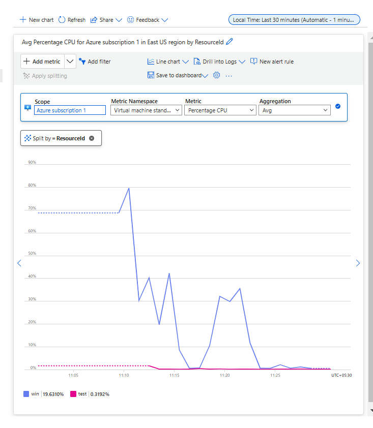
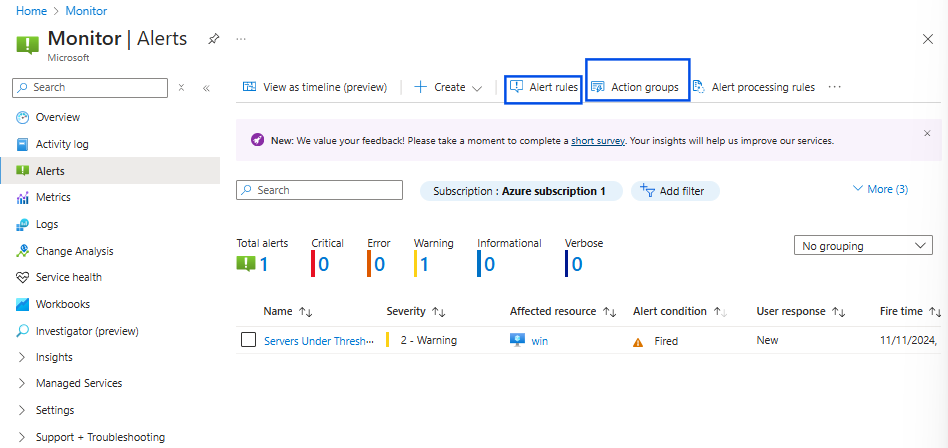
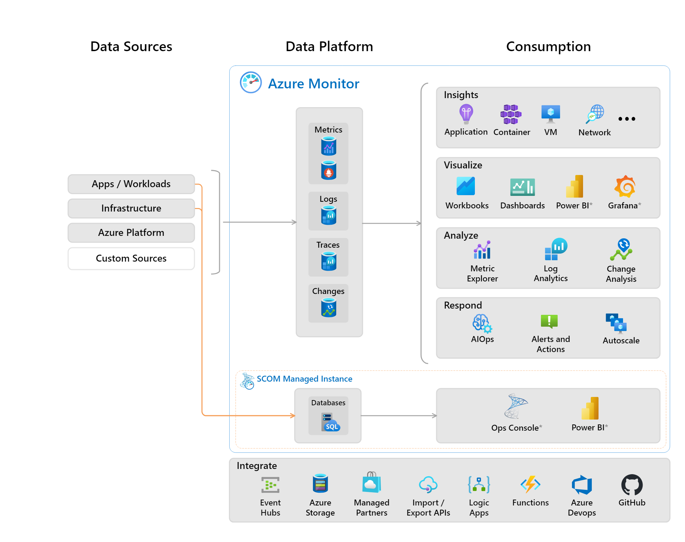

Cloud Projects:

* Project Types on Cloud :
    * Brown field Projects
        * These are already running projects on other environments(on-premices, Hosting Providers)
        * They involve migrations.
    * Green field projects
        * These are absolutly new projects and everything will run on cloud
        * They involve cloud native architectures
        
## Landing Zones :
* Landing zones define basic 
    * infra provisioning templates
    * Security Management
    * audit Management
    * Governance

## Cloud Adoption Frameworks

* These are frameworks established from various customers using cloud which will help in adopting cloud for different types of projects

What is Modrenisation:
Modernisation is the process of migrating existing applications to cloud native architectures. like An application runnning on VM moved to Server less.
This step comes post migration.

Migration Activities
--------------------
* Generally any migration can be classified into two stratagies it might be database or server
    * One time Migration
    * Continous Migration/Iterative Migration/Ongoing Migration.
* Migration types according to Workloads
    * server
    * Database
    * Storage
* When it comes to server Migration, we have two major options
    * p2V (physical to virtual)
    * V2V (Virtual to Virtual)
* When it comes to Database Migration
    * Same Engine
    * Transformation(oracle to mysql, any to any)
* when it comes to storage migration
    * One-time:
        * online 
        * Offline (AWS has snow ball, Azure has Databox)
    * Ongoing(Online) :
        * Hardware based (cloud provider will gives you a hardware box which you can connect it and transfer data to it, this syncs your data to cloud)
        * Software based(cloud provider will gives a software/OS image to install on our system then migration starts)

**web site : UPload time calculator** to calculate upload time.

* Modernization in Application
    * Paas
    * Server less
    * Containerization

    * PAAS and Serverless are vendor specific :
        * PAAS(there won't be any problem with code but you have configuration changes)
        * Serverless(if you have written a code for an application that works on AWS Lambda function, you can't run the same code in Azure functions)
    * Containarization:
        * once you containarize any application you can run it on any platform.

* Modernization in Storage
        * blob Strorage
        * Data lakes into cloud (indirectly it will also use blob storage)
* Modernization in Database
    * DBaas (Database as a service)
    * NoSql Alternatives

## what is day-0, day-1 and day-2 in terms of migration in organizations.

* Day-0, Day-1 and Day-2 are the stages of software lifecycle in context of cloud migration

* Day-0 : Planning and Preparation
* Day-1 : Deployment or "go-live" phase.
* Day-2 : refers to the ongoing and maintainance phase.

* Azure has `Azure virtual desktop` similarly in AWS `Amazon Workspace Family`.

Hybrid Network
--------------

* site to Site VPN

* Multisite to Multisite VPN (WAN/hub-spoke) [click here to see images](https://directdevops.blog/2024/07/18/multi-cloud-classroom-notes-18-july-2024/)

Operations
-----------

* Access
    * User access management
    * Network Access Management
    * Permisiion Management

* Backup and Disaster Recoveries
    * Basic Backup plans according to industry best practices.
    * Disaster Recovery
        * Automatic Recovery (Auto Failover)
            * it defines as you are maintaining one more server running as backup for primary server.
        * Manual Recovery (Manual Failover)
            * after failure occurs, within few minutes using backup creating one more vm without any intruptions.
* Automation:
    * Identify all the manual activities and enabling automation
        * CLI
        * Scripting
        * Templating
        * Python
    * Toolings:
        * Common administrative activities
* Troubleshooting
    * Monitorig
    * Logs
    * Audits
* Setups:
    * Hybrid Network setup
    * User import or integrations
    * Policy

what we learn in Operations:
---------------------------

* Monitoring & logging
    * cloudwatch(AWS)
    * Monitoring(Azure)
* Policy Setups
* BCDR'
* Automation around cli and tooling
* Migration (2 weeks)

Monitoring and Alereting
-------------------------

Activity 1: Understanding Metrics for Azure VM and configuring Alerts
--------------------------------------------------------------------

* Services :
    * Azure Monitor
    * Alerts
* Lab :
    * we will create two vms
        * Linux Server
        * Windows Server
    * We will explore all
        * Metrics available
        * plotting options
    * We will configure some alert
        * alert destination:
            * email
            * teams/slack channels
        
* Understading Alerts
    * Alert Rules : when to raise alerts
    * Action Group:
        * Notification: who should be informed
        * Actions: what actions can be taken.

**Checking Metrics of Resources**

* create two VM's after creation is done open Azure Monitor.
* select Metrics from the blade
* it will ask for scope give scope as 'virtual machines'
* locations let it be All locations or we can sort basded on requirement
* below there will be displayed structured format of subscription and and resource group 
* select the two vm's under resource group and apply
* Metrics will load select `Percentage CPU` for now and select any aggrigation `avg` your graph will loaded below.

* from image top right side there is a local time , using that you can select the time rage.
* as of now select last 30 min.
* next below you have a horizantal blade inside you can see chart types ` Line chart` you select drop down you can see the available charts you can make.

**Creating Alerts**

* Open Azure Monitor
* from the left side blade select `Alerts`

* select `Action Groups` from the horizantal options, check above image.
* Create New
    * provide Name for it
    * Give Display Name 
    * Notifications:
        * select Notification `Email/SMS message/Push/Voice`
        * Select `Email` and provide Gmail
        * select Azure Mobile App Notification.
    * Give `ok`.
    * Provide a Name for Notification.
    * Select the `Action Type` if required
        * Automation runbook = if you want to automate for the scenario you can use this
        * Azure Function = you can write a code for vm restart and you can use it.
        * ITSM = for raising incident if you are using any ticketing tool
    * as of now skip it.
    * Review and create it.
* Now come back to Alert and select `Alert Rules` 
    * Create a new rule
        * select resource type = virtual machines
        * Locations = all locations
        * from below select the vm's and `Apply`
    * Conditions:
        * select signal = `Percentage CPU`.
    * Actions:(select `Use Action Groups`)
        * from the pop-up select the action group we have created earlier.
    * Detais:
        * Severity:
            * give `warning`.
        * provide rule name.
        * rule description.
    * Review and create it.

## Azure Monitoring Stack

## Log Analytical WorkSpace

* it is kind of database which store the logs and you can query the logs using KQL language.
* when you are creating a new workspace means that indirectly you are creating a location to store the logs.

